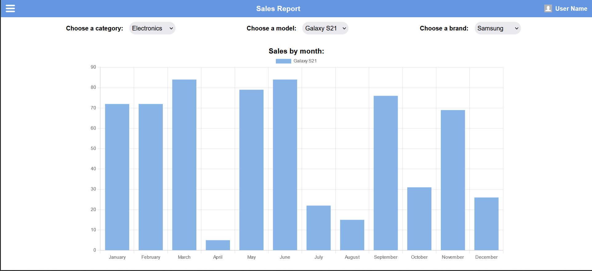

# Vue Graphs

A simple project, built with [Vue.js](https://vuejs.org/), [Vite](https://vitejs.dev/), and [Chart.js](https://www.chartjs.org/).

## Snapshots

## Dependencies needed
- Node.js v20.5.0 or higher
- yarn
- Vite

## Run locally

- Clone this repo
- Run `yarn` to install all dependencies
- Install the Vite CLI globally (if you don't already have it) running `yarn add vite -g`
- Run the application `yarn dev`
- The application opens in `http://localhost:5173/` or any other available port
